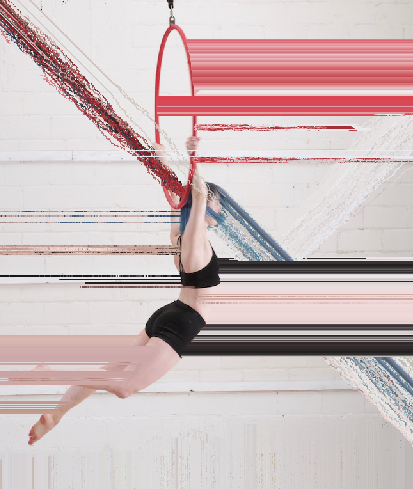

# pixel_manip_by_user_input_ofx
given input image, allow user's mouse dragging to replicate pixels in target direction. 

ofxgui options: 
pixel direction (4 cardinal directions + 4 hybrids) 
pixel jitter

demo image (post user manipulation):

my first real ofx project ~ 
